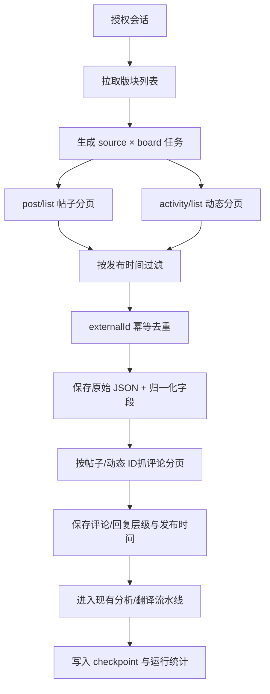

# BigPlayer API 采集器重写需求草案

## 1. 目标

基于大玩家社区 C 端 API，按版块完整抓取帖子、动态及其评论/回复，并以发布时间作为窗口依据。每次执行的窗口固定为“昨天北京时间 00:00 至当前实际执行时刻”。每条内容必须保留所属版块、原始 JSON 和统一后的字段，采集成功后入库并进入现有 AI 分析流水线。

本需求是旧 BigPlayer 采集器下线后的新实现，不恢复或复用旧采集器运行接线。运行时基地址固定从配置读取，当前正式地址为 `https://club.q1.com`。

## 2. API 能力映射

### 2.0 请求地址前缀

新采集器所有运行时 API 请求统一使用：

```text
https://club.q1.com
```

例如：

```text
https://club.q1.com/api/club/v2/auth/board
https://club.q1.com/api/club/v1/auth/post/list
https://club.q1.com/api/club/v1/auth/post/activity/list
https://club.q1.com/api/club/v1/auth/comment/{id}
```

Swagger 地址 `https://club-api.dev.q1op.com/swagger/index.html` 只用于查看接口定义和参数，不作为生产运行请求地址。代码中不得把开发域名写死为运行时地址；基地址必须配置化，并对 `club.q1.com` 做域名白名单校验。

### 2.1 版块发现

| 用途 | 方法 | 接口 |
|---|---|---|
| 获取版块信息 | `GET` | `/api/club/v2/auth/board` |
| 获取版块列表/版块 ID | `GET` | `/api/club/v2/auth/board/list` |
| 兼容旧版块信息 | `GET` | `/api/club/v1/auth/board` |

实际使用以 V2 返回为主；若 V2 缺失必要字段，再按接口能力降级到 V1。版块 ID、名称、父子层级、可采集状态必须落库。

### 2.2 帖子与动态

| 内容 | 方法 | 接口 | 用途 |
|---|---|---|---|
| 普通帖子分页 | `GET` | `/api/club/v1/auth/post/list` | 按版块分页拉取帖子 |
| 动态分页 | `GET` | `/api/club/v1/auth/post/activity/list` | 按版块分页拉取动态 |
| 单帖详情 | `GET` | `/api/club/v1/auth/post` | 详情补全 |
| 批量帖子详情 | `GET` | `/api/club/v1/auth/post/byids` | 批量补全和重试 |
| 话题下帖子 | `GET` | `/api/club/v1/auth/post/topic` | 仅在需求明确纳入话题采集时使用 |
| 帖子/动态评论 | `GET` | `/api/club/v1/auth/comment/{id}` | 获取内容的评论及回复 |

以下接口不属于本阶段主采集入口：推荐、置顶、榜单、搜索、用户帖子、模型推荐等接口只能作为后续补充来源，不能与版块主列表混用后直接计数，否则会造成重复和覆盖范围不可解释。

### 2.3 评论与回复

评论纳入本阶段主范围。对每条已发现的帖子和动态，使用 `GET /api/club/v1/auth/comment/{id}` 获取评论分页；如果响应包含回复游标或子评论入口，继续递归/分页抓取到末页。评论与回复统一保存为 `comment`，通过 `parentPlatformId`、`rootPlatformContentId` 和 `contentDepth` 保留层级。

帖子声明的评论数只作为对账指标，不能代替实际抓到的评论正文数。任务详情必须分别显示“声明评论数”和“实际评论正文数”。

## 3. 采集流程



### 3.1 任务拆分

- 一个采集源先发现全部可采集版块。
- 每个版块拆成三个 scope：`post`、`activity` 和 `comment`；评论任务挂在对应帖子/动态下。
- 帖子/动态任务唯一键：`source_id + board_id + scope + window_start + window_end`；评论任务还必须包含 `root_platform_content_id`。
- 版块任务独立记录进度，一个版块失败不得阻塞其他版块。
- 同一个版块的帖子、动态和评论默认串行，避免触发站点限流；不同版块可受控并发。
- 只有帖子/动态成功发现并完成去重后，才创建对应评论子任务；评论子任务失败不回滚帖子/动态入库，但父任务标记为部分完成。

### 3.2 授权优先级

采集器必须读取抓取账号管理中已保存的授权配置，禁止从页面或环境变量另取一套凭据：

1. 账号密码已配置：调用本机登录会话服务登录站点，取得临时 Token；Token 只在内存中使用，并由现有凭据服务加密托管/刷新，不回显、不写 URL、不写普通日志。
2. 账号密码未配置但 Token 已配置：直接使用已保存 Token 请求 API。
3. 两者都未配置：任务进入 `authorization_missing`，不得请求站点。
4. 账号密码已配置但登录失败：任务进入明确的授权失败状态，**不得静默回退到旧 Token**，避免旧 Token 掩盖账密失效。
5. 账号密码登录成功后，服务可按现有安全契约更新加密 Token；页面仍只显示脱敏状态。

### 3.3 采集时间窗口

- 每次定时或手动执行均以执行时刻计算窗口：`publishedFrom = 昨天 00:00:00 Asia/Shanghai`，`publishedTo = 当前实际执行时刻`。
- 例如北京时间 2026-09-23 16:00 执行，窗口为 `2026-09-22 00:00:00` 至 `2026-09-23 16:00:00`，不是截止到今天 00:00，也不是截止到明天 00:00。
- 帖子、动态、评论和回复统一使用发布时间过滤；评论按自身 `publishedAt` 判断是否在窗口内，同时保留所属根帖子/动态关系。
- 运行记录必须保存实际 `window_start/window_end`，页面展示北京时间，数据库和接口遵循现有 UTC 契约。

### 3.4 时间窗口实现约束

- 统一使用接口返回的 `publishedAt`/等价发布时间字段，不使用抓取时间作为内容时间。
- 数据库存储 UTC；后台按北京时间展示。
- 首次采集使用配置的历史起始时间至当前实际执行时间。
- 增量采集使用该版块/内容类型的成功游标至当前实际执行时间；评论使用根帖子/动态的独立评论游标。
- 窗口采用统一的 `[publishedFrom, publishedTo)` 语义；相邻任务边界不得重复或漏掉内容。
- 每次增量可向前重叠一个小缓冲区（推荐 5 分钟），依靠唯一键去重，抵御站点排序延迟。评论也必须应用同样的重叠和幂等规则。
- 页面选择“今天/昨天/自定义日期”只影响查询，不改变采集器的真实窗口。

### 3.5 分页停止条件

分页必须按发布时间倒序请求或校验响应顺序，并同时满足以下任一条件才停止：

1. 当前页最早发布时间早于窗口下界；
2. 接口返回明确的末页标识；
3. 游标连续两页无变化且已记录为不完整，任务进入可重试失败；
4. 达到安全页数上限时，任务必须标记 `collection_incomplete`，不能伪装成成功。

## 4. 数据模型要求

每条帖子/动态至少保存：

| 字段 | 说明 |
|---|---|
| `source_id` | 舆情采集源 |
| `board_id` | 大玩家版块 ID |
| `board_name` | 采集时的版块名称快照 |
| `external_id` | 大玩家内容 ID，作为幂等键组成部分 |
| `content_type` | `post`、`activity` 或 `comment` |
| `title` | 帖子标题；动态为空 |
| `body` | 正文文本/结构化内容 |
| `author` | 作者 ID、昵称等脱敏字段 |
| `published_at` | 原始发布时间，统一时区存储 |
| `source_url` | 内容详情地址 |
| `parent_platform_id` | 直接父评论或根内容 ID |
| `root_platform_content_id` | 所属帖子/动态 ID |
| `content_depth` | 评论层级，一级评论为 1 |
| `engagement` | 点赞、评论、浏览等原始互动量 |
| `raw_payload` | 原始接口 JSON，禁止只保存归一化结果 |
| `collected_at` | 实际抓取时间 |

唯一性至少覆盖 `source_id + external_id + content_type`；如果站点存在跨版块重复 ID，需把 `board_id` 纳入唯一键，并在文档中记录实际选择。

## 5. 运行、失败与可观测性

- API 401/403：任务进入授权失败，不重试无限循环；页面显示需要重新授权。
- 429/限流：按响应头或固定退避重试，达到上限后记录 `rate_limited`，不创建假成功。
- 单版块接口失败：只失败当前版块任务，其他版块继续；父任务状态为 `partial`。
- 评论接口失败：只失败对应根内容的评论子任务；帖子/动态仍保留，任务详情显示评论未完成，不得把声明评论数当作已抓取数。
- 返回空页：需区分“窗口内确实无数据”和“版块/参数错误”，记录请求参数摘要和响应元数据。
- 运行详情展示：版块总数、已完成/失败版块、帖子页数、动态页数、发现数、插入数、变更数、重复数、越界数和不完整版块。
- 每个版块/内容类型及每个根内容的评论分页保存 checkpoint，重启后从最后成功游标恢复，不从头假装补齐。
- 原始 JSON 中的 token、cookie、密码等敏感字段必须在落库前剔除或脱敏。

## 6. 入库与 AI 分析

### 6.1 入库顺序

1. API 返回后先校验版块、内容 ID、发布时间和分页边界。
2. 帖子、动态、评论和回复统一归一化并写入现有内容表，保留 `raw_payload`；使用平台内容 ID及根内容关系幂等 upsert。
3. 入库成功后，为新增或内容发生变化的记录创建或唤醒 AI 分析任务；重复抓取不得重复创建分析任务。
4. 分析任务异步执行，分析失败不回滚已入库内容；按现有重试、积压和终态规则处理，并在任务详情显示失败原因。
5. 分析完成后沿用现有情感、风险、关注级/负面待处理等分析结果写入和展示口径；本需求不改变算法规则。

### 6.2 失败边界

- 采集失败：不创建对应 scope 的“已完成”状态；已成功入库的其他版块和内容保留。
- 入库失败：记录内容 ID 和错误，不能把 API 成功误报成采集完成；支持按版块/窗口重试。
- AI 分析失败或排队：内容仍可在抓取内容管理查看，状态显示“待分析/分析失败”，不得丢弃内容。
- 评论失败：帖子/动态保留，评论子任务单独重试；统计分开显示声明评论数与实际评论正文数。

## 7. 后台页面口径

- 抓取账号管理：保留 BigPlayer 配置页，新增/展示“版块采集策略”摘要，不在本需求中删除后台页面。
- 抓取任务记录：任务详情按版块展示帖子、动态和评论的独立进度；分别展示帖子/动态数量、评论声明数、实际评论正文数；明确显示“窗口内无数据”和“采集不完整”的区别。
- 抓取内容管理：新增或复用版块字段，支持按版块、内容类型（帖子/动态/评论）、发布时间筛选；评论详情可回溯所属帖子/动态。
- “开始同步”使用新采集器后才恢复可用；在开发完成并通过验收前继续显示“BigPlayer 采集功能重构中，暂不可同步”。

## 8. 验收用例

1. 版块发现返回 3 个版块时，任务详情必须生成 3 × 2 个 scope，不能只抓默认版块。
2. 每个版块各存在一条帖子和一条动态，且各自有一级评论和回复；按同一发布时间窗口执行后，帖子、动态、评论和回复均入库且类型、父子层级正确。
3. 帖子分页跨页时，窗口下界之前的内容停止继续请求，窗口内内容不漏抓。
4. 同一内容在重叠缓冲区内被请求两次，只保留一条，统计为重复/变更而不是新增两条。
5. 一个版块接口 429 或失败时，其他版块仍完成；总任务标记部分完成并可按版块重试。
6. 重启 worker 后，帖子、动态和评论分别从各自 checkpoint 继续，不重复创建同一版块/窗口任务。
7. 详情页能看到版块名称、发布时间、内容类型、根内容和父评论关系、原始 JSON；原始 JSON 不含凭据。
8. 声明评论数为 100、实际接口返回 80 条时，任务显示 100/80，不得显示为已抓取 100 条。
9. 国内、境外 BigPlayer 源各执行一轮；其他平台回归不受影响。

## 9. 需求评审结论

### 已覆盖

- C 端 API 版块发现、帖子、动态、评论和回复的来源与调用顺序。
- B 端抓取账号管理配置读取、账号密码/Token 优先级和敏感信息边界。
- 帖子/动态/评论按发布时间的昨日窗口、版块拆分、分页、幂等和 checkpoint。
- 入库、AI 分析任务创建、异步失败重试、历史数据和其他平台回归边界。

### 待确认

- 首次正式上线是否只补跑最近 7 天，还是由项目经理安排更长历史窗口；本次“昨天窗口”本身已确认。
- 账号密码登录遇到图形验证码/人工挑战时，是否允许进入现有人工核验流程；推荐沿用现有登录会话服务，不在采集器内绕过。
- 版块 ID 是否全部由 API 动态发现，还是允许在抓取账号管理中配置版块白名单；当前推荐动态发现，超能国服首个样本固定验证 `boardId=2`。

### 缺失/风险

- 旧归一化链把动态标成帖子，若新实现复用旧映射会导致内容类型和概览统计错误。
- “全部”动态 feed 与分类 feed 有重叠，必须先按平台内容 ID 去重再入库，否则会重复分析。
- 账密登录成功后 Token 的刷新和失效要由本机登录会话/凭据服务托管，不能复制到前端或普通日志。
- AI 分析是异步链路，必须区分“未分析、分析中、分析失败、分析完成”，不能用采集成功替代分析完成。
- 昨天 00:00 到实际执行时刻会包含今天部分内容，列表和运行详情必须展示真实窗口，避免误解为只抓自然日昨天。

### 建议补充的验收用例

1. **账密优先**：前置条件为账号密码和旧 Token 同时存在 → 执行采集 → 预期使用账密登录取得 Token；登录失败时任务失败，不回退旧 Token。
2. **Token 兜底**：前置条件为无账号密码、有有效 Token → 执行采集 → 预期直接请求 API 并成功，不触发登录页面。
3. **昨日到当前时刻窗口**：前置条件为北京时间 16:00 执行 → 操作查看运行详情 → 预期窗口为昨天 00:00 至当天 16:00，帖子、动态和评论统一过滤。
4. **版块完整性**：前置条件为 board 返回多个 section/feed → 执行采集 → 预期每个版块都有独立结果，任何一个版块失败不影响其他版块。
5. **动态类型**：前置条件为 `activity/list` 返回无标题动态 → 入库并查看内容管理 → 预期类型为动态，不显示“无标题”占位标题。
6. **重叠去重**：前置条件为“全部”与分类 feed 返回同一内容 → 执行采集 → 预期只入库一条，只创建一个 AI 分析任务。
7. **评论与回复**：前置条件为帖子和动态均有一级评论/回复 → 执行采集 → 预期评论完整入库，父子关系、根内容 ID 和发布时间正确。
8. **分析异步**：前置条件为 AI 服务暂时不可用 → 执行采集 → 预期内容已入库，显示待分析/失败并可重试，不把内容丢弃。
9. **其他平台回归**：前置条件为 Discord、TapTap、Facebook 源存在 → 执行新 BigPlayer 采集 → 预期其他平台调度、授权和内容查询不受影响。

## 10. 待确认项

### 8.1 已完成只读样本验证（2026-09-23）

使用“超能世界国服版”已配置的账号密码登录流程取得临时授权后，对 `https://club.q1.com` 的 `boardId=2` 执行了昨天窗口只读验证：

- 北京时间窗口：`2026-09-22 00:00:00` 至 `2026-09-23 00:00:00`，传输时间为 `2026-09-21T16:00:00Z` 至 `2026-09-22T16:00:00Z`。
- 版块 feed：23 个，其中资讯/帖子类 17 个，动态类 6 个。
- 各 feed 原始返回合计 362 条；由于“全部”动态 feed 与分类 feed 有重叠，按内容 ID 去重后为 185 条。
- 帖子样本覆盖“官方资讯”“攻略大全”等版块；动态样本覆盖“闲聊杂谈”“晒图分享”“视频分享”“问题求助”等版块。
- `GET /api/club/v1/auth/comment/{id}` 对帖子和动态均可正常请求，抽样评论均能按发布时间返回；评论回复需继续走分页/子评论游标。
- 旧归一化链会把 `activity/list` 的结果也写成 `contentType=post`；新实现必须以 feed 的 `endpointKind=activity` 映射为 `activity`/“动态”，不能使用标题是否为空来猜类型。
- 该次验证只读请求，没有写入舆情数据库，也没有把账号密码或 Token 输出到日志。

| 问题 | 推荐默认值 | 影响 |
|---|---|---|
| 首次历史回溯范围 | 最近 7 天 | 先控制请求量，后续可按版块补历史 |
| 版块层级 | 保存父子关系，任务按叶子/可发帖版块执行 | 避免父版块与子版块重复 |
| 版块改名处理 | 保存 ID + 当前名称 + 名称快照 | 历史内容按抓取时名称可追溯 |
| 并发度 | 同源串行、跨版块最多 2 | 优先稳定性，后续按限流证据调整 |

## 11. 本阶段不做

- 不恢复旧 BigPlayer 采集器。
- 不修改负面/关注级算法、翻译、概览、通知和其他平台采集逻辑。
- 不删除或改写历史 BigPlayer 内容、任务和配置。
- 不恢复旧 BigPlayer 采集器，不把新采集器接回旧的 HTML 爬取逻辑。

## 12. 交接条件

用户已确认：按本方案重写新 BigPlayer 采集器，评论纳入；账密优先，未配置账密时使用 Token；每次窗口为昨天 00:00 至当前实际执行时刻；采集后入库并进入 AI 分析。除首次历史回溯范围等未决口径外，开发负责人只实现本文件范围；交接消息必须注明“用户已弹窗拍板”。
