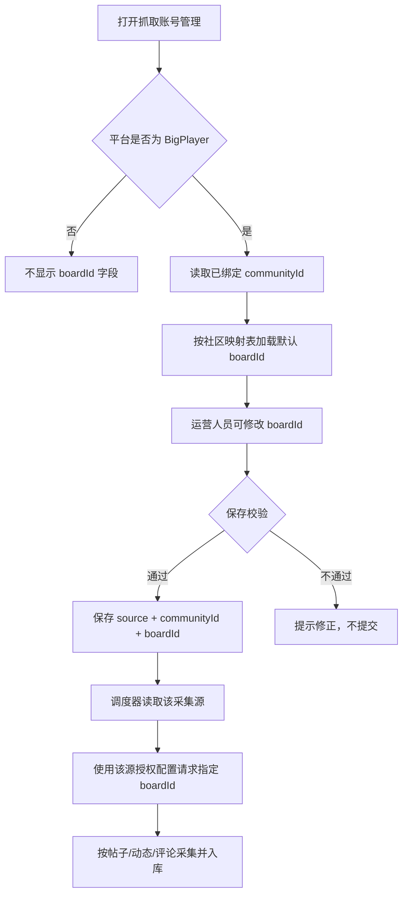

# BigPlayer 版块 ID 配置与采集规则 PRD

## 1. 需求概述

### 背景/目标

不同社区的 BigPlayer 抓取账号、站点和版块映射不同。现有采集器不能把固定的 `boardId` 当作社区身份，否则同一 `boardId` 在不同社区或不同账号下会发生数据串用。

本次调整要求：

1. 在抓取账号管理的 BigPlayer 配置抽屉中，采集频率下方增加 `boardId` 输入框。
2. 根据社区映射表为对应社区的 BigPlayer 采集源自动填充默认 `boardId`。
3. 新采集器按采集源绑定的 `communityId` 选择社区，再把该采集源配置的 `boardId` 作为接口请求参数；不得用 `boardId` 识别或切换社区。
4. 采集结果必须同时保留 `sourceId`、`communityId` 和 `boardId`，便于追溯和隔离。

### 用户对象

舆情分析系统的运营人员、社区运营和采集任务维护人员。

## 2. 页面交互流程图



## 3. 核心字段定义

### 3.1 采集源列表字段

| 字段名称 | 说明 |
| :--- | :--- |
| 采集源/账号 | 采集源名称和账号标识 |
| 地区/社区 | 展示地区和社区名称；后台关联 `regionCode`、`communityId` |
| 平台 | BigPlayer 社区、Discord、TapTap 等 |
| 版块 ID | 仅 BigPlayer 展示，展示该采集源保存的 `boardId`；非 BigPlayer 显示 `-` |
| 授权 | 沿用现有授权状态 |
| 帖子/评论 | 沿用现有同步统计 |
| 同步策略 | 沿用现有频率和启用状态 |

### 3.2 表单字段（抽屉）

| 字段 | 类型 | 必填 | 默认值 | 校验/说明 |
| :--- | :--- | :---: | :--- | :--- |
| 采集源名称 | 单行文本 | 是 | 沿用现有值 | 沿用现有名称校验 |
| 采集频率 | 下拉 | 是 | 沿用现有默认值 6 小时 | 枚举：1 小时、6 小时、1 天 |
| 版块 ID（boardId） | 正整数输入框 | BigPlayer 必填 | 按 `communityId` 映射自动填充 | 仅 BigPlayer 显示和提交；必须为大于 0 的整数；不允许填社区名称或 URL |
| 站点地址 | 单行地址列表 | BigPlayer 按现有规则 | 沿用现有值 | 本次不改变多站点能力 |
| 授权方式 | 分段控件 | 是 | 沿用现有值 | Token/账号密码沿用现有账密优先规则 |

### 3.3 数据关联字段

| 字段 | 用途 | 是否作为社区路由键 |
| :--- | :--- | :---: |
| `sourceId` | 唯一标识一条抓取账号/采集源配置 | 否，作为任务配置主体 |
| `communityId` | 舆情系统社区记录，决定数据归属和隔离边界 | 是 |
| `platform` | 选择对应平台采集器 | 是，决定适配器 |
| `boardId` | BigPlayer 接口的版块参数，决定该社区内抓哪个版块 | 否 |

## 4. 社区映射与默认值

### 4.1 映射来源

图 2、图 3展示的接口返回对象使用 `id` 表示版块 ID，产品字段统一命名为 `boardId`，`name` 作为版块名称展示和校验提示。映射数据应以对应社区接口返回的 `id/name` 为准，不能把截图文字硬编码成跨社区规则。

### 4.2 已确认样例

| 社区/版块 | `boardId` | 来源 |
| :--- | ---: | :--- |
| 超能世界 | 2 | 图 2 国内映射表 |
| 圣魂纷争 | 1 | 图 2 国内映射表 |
| 枭雄传 | 3 | 图 2 国内映射表 |
| 远征 2 | 4 | 图 2 国内映射表 |
| 妖神记 | 5 | 图 2 国内映射表 |
| 位面英雄 | 6 | 图 2 国内映射表 |
| 元素乐园 | 7 | 图 2 国内映射表 |
| 千灵城 | 8 | 图 2 国内映射表 |
| 欢乐战三国 | 9 | 图 2 国内映射表 |
| 吸血鬼手游 | 10 | 图 2 国内映射表 |
| 天境传说手游 | 11 | 图 2 国内映射表 |
| 逍遥情缘 | 13 | 图 2 国内映射表 |
| 太初界 | 14 | 图 2 国内映射表 |
| 择日飞仙 | 19 | 图 2 国内映射表 |
| Last Light | 100017 | 图 3 境外映射表 |

说明：截图中还存在其他映射项，开发实现应以接口返回的完整映射为准。`超能世界国服版` 使用国内映射中的“超能世界”，默认 `boardId=2`。

### 4.3 默认填充规则

1. 新建 BigPlayer 采集源时，先确定绑定的 `communityId`，再按映射表填入默认 `boardId`。
2. 编辑已有 BigPlayer 采集源时，若已有合法 `boardId`，保留用户已保存值，不因页面刷新覆盖。
3. 映射表找不到对应社区时，字段置空并显示“未找到默认版块 ID，请手动填写”；保存或开始同步前必须补齐。
4. 不允许用 `boardId=0`、空值或“全部”作为隐式兜底；避免误抓其他社区数据。
5. v1 每条 BigPlayer 采集源配置一个 `boardId`。同一社区确需抓多个版块时，先创建多条采集源配置；本次不扩展为多值文本域。

## 5. 采集器路由规则

### 5.1 正确的路由关系

```text
采集源 sourceId
  -> 绑定 communityId（决定归属）
  -> 绑定 platform=bigplayer_h5（选择 BigPlayer 适配器）
  -> 读取该源自己的授权配置
  -> 读取该源自己的 boardId（决定请求哪个版块）
  -> 请求帖子、动态、评论/回复
```

### 5.2 禁止规则

- 禁止使用 `boardId` 查找或推断 `communityId`。
- 禁止把 `boardId=2` 写成所有 BigPlayer 社区的固定值。
- 禁止跨 `sourceId` 复用授权 Token、站点地址或 boardId。
- 禁止因多个社区恰好拥有相同 `boardId` 而合并数据。
- 禁止把接口返回的 `id` 直接写入 `communityId` 字段。

### 5.3 任务唯一性与入库

BigPlayer 任务唯一键至少包含：

```text
sourceId + communityId + boardId + scope + windowStart + windowEnd
```

内容入库至少保留：

```text
sourceId、communityId、boardId、boardName、externalId、contentType、publishedAt、rawPayload
```

同一 `boardId` 在不同社区或不同采集源下必须分别入库、分别统计、分别进入 AI 分析。

## 6. 功能逻辑与筛选项

### 表单显示

- `platform=bigplayer_h5` 时，在“采集频率”下方显示“版块 ID（boardId）”。
- 其他平台不显示该字段，也不向后端提交该字段。
- 社区名称用于展示，实际提交使用隐藏的 `communityId`。

### 保存

- BigPlayer 缺少 `boardId`、格式非法或不在映射校验范围内时，阻止保存并定位输入框。
- 保存成功后重新打开抽屉，值必须仍然存在；列表同步显示 `boardId`。
- 保存失败不得清空用户已填写的站点地址、授权方式和 boardId。

### 开始同步/定时同步

- 任务创建时从同一 `sourceId` 原子读取 `communityId`、`boardId`、授权和频率，禁止拆到全局默认配置。
- 使用该源配置的 `boardId` 请求 BigPlayer API。
- 按已确认规则抓取昨日 00:00 至当前执行时刻的帖子、动态、评论和回复。
- 采集成功后入库并进入 AI 分析；失败只影响当前 source/board 任务，不串扰其他社区。

## 7. 异常与边界

| 场景 | 处理 |
| :--- | :--- |
| 社区没有映射 | 显示“未找到默认版块 ID”，要求手动填写；未填写前不能同步 |
| `boardId` 不是正整数 | 保存时校验失败，保留输入内容并提示 |
| API 返回版块不存在/无权限 | 当前 source 任务标记为 `board_not_accessible`，不回退到其他 boardId |
| 两个社区使用相同 `boardId` | 依靠 `communityId + sourceId` 隔离，分别采集和统计 |
| 同一社区配置多个采集源 | 每个 source 独立授权、频率、boardId 和任务；不得合并凭据 |
| 非 BigPlayer 旧数据没有 boardId | 页面不显示该字段，旧平台流程不受影响 |
| 编辑后刷新 | 从已保存配置回显，不重新用默认值覆盖 |
| 重复点击保存/同步 | 按钮进入提交态；同一 source/window/board 只允许一个运行任务 |

## 8. 验收标准

1. 新建 BigPlayer“超能世界国服版”采集源时，频率下方出现 `版块 ID（boardId）`，默认值为 `2`。
2. 新建 Discord、TapTap 等非 BigPlayer 采集源时，不出现该字段，原有表单和保存逻辑不变。
3. 修改 BigPlayer 的 `boardId` 后保存，重新打开仍回显修改后的值。
4. 两个社区配置相同 `boardId` 时，任务、入库内容、统计和 AI 分析仍按 `communityId/sourceId` 分开。
5. 同一社区配置不同 `boardId` 时，采集器只请求当前采集源配置的版块，不抓取其他版块。
6. API 返回版块不存在或无权限时，任务明确失败，不偷偷切换默认版块。
7. 任务详情能同时查看社区名称、`communityId`、`boardId`、版块名称和内容类型。
8. 已有 Discord、TapTap、Facebook 等平台的调度和数据不受本次改动影响。

## 9. 交接说明

本需求已按用户确认口径收口：

- 用户已确认：BigPlayer 配置新增 `boardId` 输入，按社区映射表默认填充。
- 用户已确认：`communityId` 才是社区归属键，`boardId` 只用于请求该社区下的版块数据。
- 用户已确认：新采集器不能使用 `boardId` 区分不同社区。

请项目经理评审数据字段、默认映射来源和验收用例后，派开发负责人实现并安排测试；本产品经理会话不直接修改业务代码。
