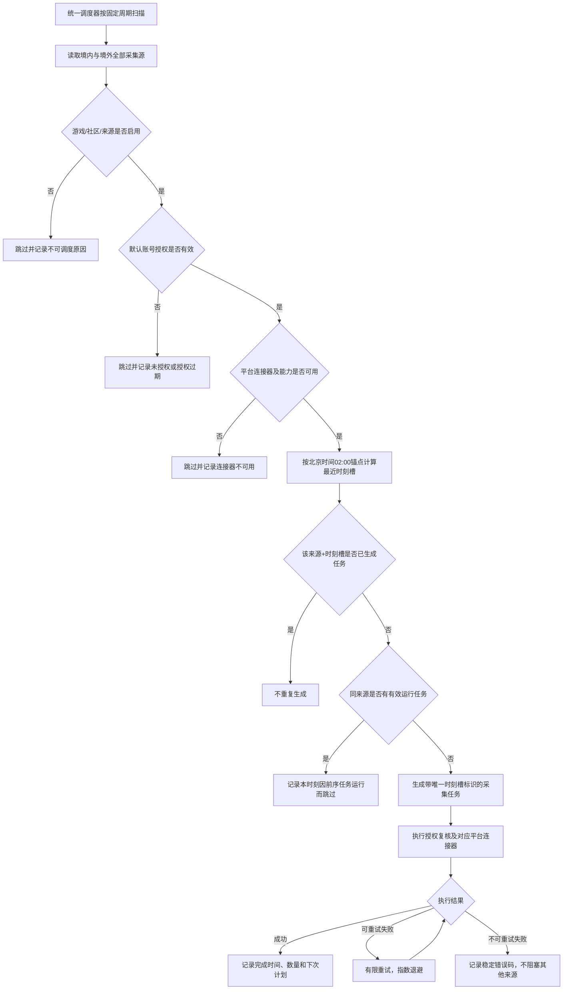

# 全社区采集源统一定时调度需求

## 1. 需求概述

### 1.1 背景

抓取账号管理已支持 BigPlayer 社区、Discord、Facebook、X、Lounge 等平台，并允许为采集源配置授权信息和采集频率。当前系统存在常驻 Worker 扫描与独立每日任务两套调度方式，外部任务安装方式又偏向单一平台，疑似造成 Discord 来源能够定时执行，而其他已配置、已授权来源没有按频率稳定运行。

本需求将调度规则统一到“采集源”维度。无论社区属于境内还是境外、来源属于哪个平台，只要满足调度准入条件，就必须按相同的时刻槽算法触发对应连接器，不再按平台单独决定是否拥有定时能力。

### 1.2 目标

- 境内、境外的全部有效社区使用同一套调度规则。
- BigPlayer 社区、Discord、Facebook、X、Lounge 及后续新增平台均通过统一调度入口执行。
- 每天以北京时间 02:00 为固定锚点，按每个采集源配置的频率生成固定执行时刻。
- 服务短暂中断后只补跑最近一次应执行时刻，避免任务集中回放。
- 单个来源失败、授权过期或连接器异常时，不阻塞其他来源。
- 管理员能够从采集源列表和任务记录判断“何时应跑、是否已跑、为什么没跑”。

### 1.3 用户对象

- 舆情后台管理员：配置来源、账号、授权和采集频率，查看调度结果。
- 舆情运营人员：确认各社区内容是否按预期更新。
- 运维与开发人员：依据稳定状态码定位漏调度、授权和连接器问题。

### 1.4 不在本期范围

- 不新增或替换平台采集连接器。
- 不绕过平台授权、限流或权限边界。
- 不改变各连接器实际可采集的数据范围。
- 不为不同平台继续创建互相独立的业务调度规则。
- 不将“连接器尚未接入”包装为采集成功。

## 2. 核心口径

### 2.1 调度准入条件

一个采集源必须同时满足以下条件才进入调度：

1. 所属区域为有效枚举：`domestic` 或 `overseas`。
2. 所属游戏已启用。
3. 所属社区已启用。
4. 采集源未删除且已启用。
5. 至少存在一个已启用的默认采集账号。
6. 来源与默认账号的有效授权状态均为 `authorized`，且授权未过期。
7. 当前平台存在已配置的连接器，且连接器声明支持该来源要求的采集能力。
8. 当前没有同一采集源仍在运行且租约有效的任务。

区域和平台只用于范围、连接器选择与数据隔离，不得成为跳过统一调度的特殊条件。

### 2.2 时间与频率

- 统一时区：`Asia/Shanghai`。
- 每日锚点：北京时间 `02:00:00`。
- 采集频率：沿用来源配置的 `frequency_seconds` 及现有平台频率校验规则。
- 每个业务日定义为当日 02:00（含）至次日 02:00（不含）。
- 第 `k` 个执行时刻为：`当日 02:00 + k × frequency_seconds`，且必须落在当前业务日内。
- `frequency_seconds = 86400` 时，每天只产生一个 02:00 时刻。

示例：

| 采集频率 | 当日计划时刻 |
| :--- | :--- |
| 15 分钟 | 02:00、02:15、02:30……次日 01:45 |
| 1 小时 | 02:00、03:00、04:00……次日 01:00 |
| 6 小时 | 02:00、08:00、14:00、20:00 |
| 12 小时 | 02:00、14:00 |
| 1 天 | 02:00 |

### 2.3 02:00 首槽的数据窗口

- 每日 02:00 首槽保留现有“前一北京时间自然日”采集口径，目标窗口为 `[昨日 00:00, 今日 00:00)`。
- 该首槽必须覆盖所有符合准入条件的境内、境外来源，不得仅覆盖 Discord 或某个指定来源。
- 频率小于 1 天的来源，其余日内时刻执行增量采集，从持久化检查点继续。
- 前一自然日任务与日内增量任务使用相同的来源准入、授权校验、幂等、租约和失败记录机制。

### 2.4 漏点、首次授权与配置变更

- 调度器恢复时，如已错过多个时刻，只补跑“当前时间之前最近一个尚未生成任务的时刻”。
- 不逐个补跑更早时刻，防止服务恢复后形成任务风暴。
- 新来源或新授权账号在当日锚点之后首次满足准入条件时，立即补跑最近一个时刻一次。
- 修改采集频率后，新频率从保存时间之后的下一个尚未到达时刻生效；不追溯重算已完成或已跳过时刻。
- 停用来源、停用账号、停用社区或授权失效后，尚未开始的任务不得继续执行。

## 3. 页面交互流程图

## 4. 详细字段定义

### 4.1 采集源列表字段

| 字段名称 | 枚举值 / 说明 |
| :--- | :--- |
| 来源名称 | 采集源展示名；保留当前行为。 |
| 地区 / 社区 | 展示区域、游戏、社区完整归属；区域至少区分境内、境外。 |
| 平台 | BigPlayer 社区、Discord、Facebook、X、Lounge 或后续已注册平台。 |
| 授权 | `已授权`、`待验证`、`未授权`、`已过期`；按来源与默认账号的有效状态计算。 |
| 调度状态 | `调度中`、`已暂停`、`不可调度`；不可调度时必须提供原因。 |
| 采集频率 | 当前来源配置的频率。 |
| 下次采集 | 按北京时间 02:00 锚点计算的下一个计划时刻；不可调度时显示 `--`。 |
| 最近同步 | 最近一次实际完成时间；不得用任务创建时间代替。 |
| 最近结果 | `成功`、`部分完成`、`失败`、`跳过`、`运行中`，并显示脱敏原因。 |
| 帖子 / 评论 | 沿用当前累计或本次同步数据口径，但页面必须标明口径。 |
| 操作 | `开始同步`、`管理`；手动同步不改变后续固定时刻槽。 |

### 4.2 来源管理抽屉字段

| 字段 | 类型 | 必填 | 默认值 | 校验 / 枚举 |
| :--- | :--- | :--- | :--- | :--- |
| 归属范围 | 只读级联 | 是 | 当前选择 | 区域 / 游戏 / 社区必须一致且社区已启用。 |
| 平台 | 只读或枚举 | 是 | 当前平台 | 创建后不得直接切换平台。 |
| 采集源名称 | 文本 | 是 | 平台默认名 | 去除首尾空格；沿用现有唯一性规则。 |
| 启用 | 开关 | 是 | 新建后关闭 | 只有授权及连接器能力满足时允许开启。 |
| 采集频率 | 下拉选择 | 是 | 沿用平台默认值 | 沿用现有平台最小频率限制；保存后展示下一生效时刻。 |
| 调度时区 | 只读文本 | 是 | `北京时间（Asia/Shanghai）` | 本期不可修改。 |
| 每日锚点 | 只读时间 | 是 | `02:00` | 本期不可修改。 |
| 下次采集 | 只读时间 | 否 | 系统计算 | 保存频率后实时重算。 |
| 授权信息 | 平台专属字段 | 视平台而定 | 无 | 凭据不回显明文；授权验证成功后才可进入调度。 |

### 4.3 抓取任务记录字段

| 字段名称 | 说明 |
| :--- | :--- |
| 任务 ID | 系统唯一标识。 |
| 来源 / 平台 / 社区 | 创建任务时的归属快照。 |
| 触发方式 | `scheduled`、`scheduled_catchup`、`manual`。 |
| 计划时刻 | 固定时刻槽时间；手动任务显示 `--`。 |
| 实际开始 / 完成时间 | 任务真实生命周期时间。 |
| 数据窗口 | 02:00 首槽显示前一自然日范围；日内任务显示增量。 |
| 状态 | `queued`、`running`、`completed`、`partial`、`failed`、`skipped`。 |
| 结果计数 | 发现、抓取、写入、新增、更新、评论及回复数量。 |
| 失败 / 跳过原因 | 稳定错误码与脱敏说明。 |

## 5. 功能逻辑与筛选项

### 5.1 统一调度

- 调度器不得按当前页面筛选条件运行；页面筛选仅影响展示。
- 每次扫描必须覆盖所有区域和社区，但任务执行继续保留来源级并发上限。
- 不同来源可以并发，同一来源不得并发。
- 任务唯一键至少包含 `source_id + scheduled_at + trigger_type`，重复扫描不得重复入队。
- 调度任务创建后、真正执行前再次校验来源、账号、社区和授权状态，状态变化时 fail-closed。
- 手动点击“开始同步”只创建 `manual` 任务，不改变、占用或重置下一固定时刻槽。

### 5.2 筛选联动

- 区域切换后刷新可选游戏与社区。
- 社区切换后只展示该社区来源，但不得影响后台全局调度范围。
- 平台筛选包含 BigPlayer 社区、Discord、Facebook、X、Lounge；尚未接入连接器的平台可以展示配置，但必须显示 `不可调度 / 连接器不可用`。
- 状态筛选至少支持：全部、调度中、未授权、授权过期、连接器不可用、最近失败。

### 5.3 失败隔离与重试

- 单个来源失败不得终止本轮其他来源的任务生成或执行。
- 网络超时、限流和临时连接失败允许有限重试；默认最多 3 次，采用指数退避。
- 未授权、权限不足、连接器不存在、配置非法属于不可重试错误，当前时刻直接失败或跳过。
- 当前时刻最终失败后，不阻塞下一个计划时刻；但页面必须持续显示最近失败，直到后续成功或管理员处理。
- 同一来源的上一任务仍在运行时，本时刻不得并发创建第二个采集任务，应记录 `PREVIOUS_RUN_ACTIVE`。

## 6. 异常与边界情况

### 6.1 数据异常

- 来源没有默认账号：不可调度，原因 `ACCOUNT_NOT_FOUND`。
- 来源与账号社区归属不一致：不可调度，原因 `OWNERSHIP_MISMATCH`。
- 来源显示已授权但账号未授权，或反向不一致：以不可调度处理，并提示重新检测授权。
- 授权过期时间缺失但连接器复核失败：立即回写授权异常，不执行采集。
- 平台没有连接器：显示 `CONNECTOR_NOT_FOUND`，不得生成空成功记录。

### 6.2 时间边界

- 夏令时不影响锚点，统一使用北京时间。
- 服务在 02:00 前启动：等待 02:00 首槽。
- 服务在 02:00 后首次启动：补跑最近一个已错过时刻一次。
- 服务跨多个业务日停止：恢复后仍只补跑当前时间之前最近一个时刻，不逐日追溯；历史回补由管理员显式发起。
- 修改服务器系统时区不得改变业务时刻计算。

### 6.3 性能与容量

- 调度扫描只计算到期来源，不遍历内容明细。
- 来源数量较多时按来源并发上限分批执行，不允许无上限并发请求外部平台。
- 调度扫描、任务入队与租约领取必须幂等，支持多个 Worker 竞争但只允许一个任务成功领取。
- 任务必须设置有限截止时间；超时后进入稳定失败终态并释放租约。

### 6.4 权限与安全

- 仅具备采集源管理权限的管理员可修改启用状态、频率和授权。
- 只读用户可查看计划时间、状态和脱敏失败原因，不可触发手动同步。
- Token、Cookie、密码、Authorization 和 API key 不得进入页面、URL、任务记录、日志或错误消息。
- 调度器不得尝试未授权来源，也不得以空数据伪报成功。

### 6.5 操作异常

- 保存频率失败：保留旧配置与旧下次计划，不做前端乐观覆盖。
- 重复点击保存：服务端幂等处理，最终只保留一个生效版本。
- 页面 API 失败：对应字段显示加载失败并允许刷新，不显示错误的下次采集时间。
- 调度服务不可用：页面展示调度健康异常，不得仅以来源授权状态暗示任务正在运行。

## 7. 数据与接口要求

产品层要求接口能够稳定提供以下信息，具体表结构由开发方案确定：

- 来源当前有效调度状态。
- 当前配置版本与生效时间。
- 最近一个已处理时刻槽。
- 下一个计划时刻。
- 最近任务的触发方式、计划时刻、实际时间与终态。
- 调度器整体健康状态和最近一次成功扫描时间。

更新采集频率后，接口响应必须直接返回新配置对应的 `nextScheduledAt`，避免前端自行推算产生时区或边界差异。

## 8. 验收标准

1. 境内与境外各选择至少一个已启用、已授权来源，均能按各自频率产生计划任务。
2. BigPlayer 社区与 Discord 各至少一个来源在相同调度器下成功执行，不依赖平台专属业务定时任务。
3. 对已接入连接器的其他平台，配置并授权后可以按同一规则入队；未接入平台明确显示不可调度，不伪报成功。
4. 每天北京时间 02:00，所有符合条件的来源均进入前一自然日窗口任务；不能只出现 Discord 来源。
5. 频率为 1 小时的来源在一个业务日内按 02:00、03:00、04:00……生成任务，计划时间不因上次完成耗时而漂移。
6. 服务停止 3 个以上时刻后恢复，每个来源只补跑最近一个时刻，不生成历史任务洪峰。
7. 同一来源同一时刻槽重复扫描 10 次，只产生一个任务。
8. 同一来源上一任务仍在运行时不并发启动，任务记录显示 `PREVIOUS_RUN_ACTIVE`。
9. 一个来源授权过期或执行失败时，其他有效来源仍能正常完成。
10. 停用来源、账号、社区或游戏后，不再产生新计划任务；历史任务仍可查询。
11. 修改频率后，接口和页面显示一致的下次采集时间，并从下一个未来时刻生效。
12. 采集源列表与任务记录能够还原每个来源“应跑、已跑、未跑原因”的完整证据链。
13. 自动化测试覆盖时刻槽计算、跨日、漏点补跑、幂等、授权闸门、同源互斥、失败隔离和频率变更。
14. 本机端到端验收需实际运行调度器，核对数据库任务记录、API 返回和后台页面三者口径一致。

## 9. 交付优先级

| 优先级 | 范围 |
| :--- | :--- |
| P0 | 统一调度入口、全区域来源扫描、02:00 固定锚点、按频率时刻槽、授权闸门、任务幂等、同源互斥。 |
| P0 | BigPlayer 社区与 Discord 均能实际定时运行，消除单平台漏调度。 |
| P1 | 列表补充下次采集、调度状态和最近结果；任务记录补充计划时刻与触发方式。 |
| P1 | 调度健康状态、稳定错误码、有限重试和异常告警。 |
| P2 | 后续平台接入连接器后自动继承统一调度，无需新增平台专属定时任务。 |

## 10. 已确认决策

- 采用统一来源调度器，不继续按平台维护独立业务调度。
- 每天北京时间 02:00 为固定锚点。
- 按来源采集频率生成固定时刻槽，不采用“上次完成后再计时”。
- 错过多个时刻时只补跑最近一次。
- 国内和境外执行相同规则。
- 02:00 首槽保留前一自然日数据窗口，并覆盖全部符合条件的来源。
