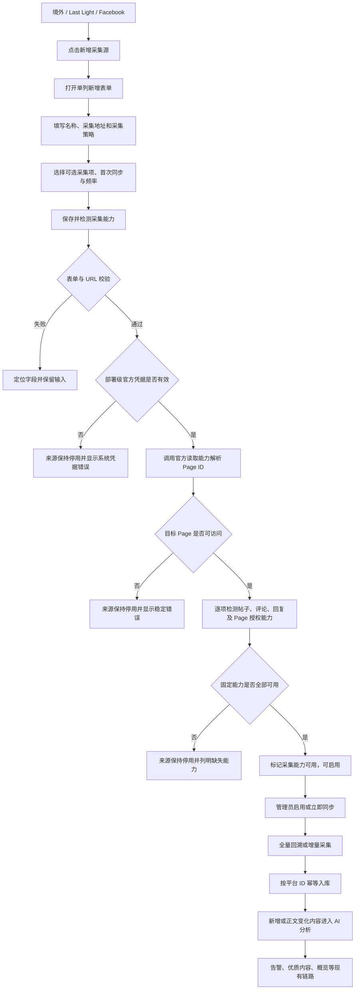

# Facebook 主页采集源需求

## 1. 需求概述

- **背景/目标**：境外 Last Light 社区的“抓取账号管理”当前能够筛选 Facebook，但写接口未开放 Facebook，系统也没有 Facebook 连接器，因此无法新增来源或执行真实采集。本需求接入 Facebook 官方 Graph API，允许管理员仅配置可修改的 Facebook 主页地址，不要求在采集源表单填写 Token；服务端统一使用部署级受控官方凭据，在目标 Page 实际能力允许的范围内采集帖子、评论和回复，并复用现有“内容入库 → AI 分析 → 风险告警 / 优质内容”链路。
- **用户对象**：具备舆情采集源管理权限的后台管理员。
- **默认业务范围**：
  - 地区：境外。
  - 社区：Last Light。
  - 平台：Facebook。
  - 默认采集地址：`https://www.facebook.com/LastLightSurvival`。
- **“全部”口径**：以部署级官方凭据和目标 Page 实际 capability 为边界，分别遍历可返回的帖子、顶层评论和评论回复，直至各自分页游标耗尽。平台未开放、未授权、已删除、受年龄/地区限制或其他官方能力不可返回的数据不计入“可采集全部”，系统不得声称覆盖 Facebook 平台不可访问内容。
- **完整评论与回复前置**：若业务验收要求完整读取评论和回复，目标 Page 必须完成管理授权，并向部署级官方凭据授予 `MODERATE` 能力；未满足时只能按实际返回范围采集并明确标记能力不足，不得伪报完整。
- **不在本期范围**：
  - 未授权网页爬取、个人账号 Cookie、模拟登录或绕过平台风控。
  - 私人主页、私密群组、私信及未授权页面。
  - 发帖、评论、点赞等写入 Facebook 的操作。

## 2. 已拍板决策

- **用户已弹窗拍板**：采用方案 1“Facebook 官方采集能力”。
- **用户已弹窗拍板**：新增/编辑采用单列表单，不使用双栏。
- **用户明确调整**：采集源表单不需要 Page Access Token，删除 Token、Token 到期时间及相关凭据操作。
- 管理员只配置主页地址和采集策略；系统使用部署级受控官方凭据，不在来源表单展示凭据内容，也不得要求管理员为每个来源重复配置。
- “管理员无需填写 Token”不等于匿名调用 Meta Graph API；部署环境未配置有效官方凭据时，能力检测与采集必须失败并显示稳定错误。
- 帖子、评论、回复为固定采集范围；媒体元数据和互动统计默认开启，可配置关闭。
- 新建来源默认停用；保存并完成主页身份及采集能力检测后，管理员才可启用。

## 3. 当前现状与差距

| 项目 | 当前状态 | 本需求目标 |
| :--- | :--- | :--- |
| Facebook 页面筛选 | 已支持只读筛选 | 保留 |
| 新增/编辑 Facebook 来源 | 写接口白名单不支持 | 支持 |
| Facebook 连接器 | 未注册；调度测试按“缺少连接器”处理 | 接入官方 Graph API 连接器 |
| 采集地址 | Facebook 无专属字段 | 支持创建及编辑 |
| 可用性检测 | 无 Facebook 采集能力 | 校验部署级凭据、主页身份、Page 管理授权及帖子、评论、回复逐项能力 |
| 帖子/评论采集 | 无 | 全量回溯与增量同步 |
| 入库与 AI | 已有公共链路 | Facebook 内容复用并真实跑通 |
| 统一调度 | 已定义平台无关调度规则 | Facebook 满足准入后自动继承 |

## 4. 页面交互流程图

## 5. 页面结构

### 5.1 列表字段

| 字段名称 | 枚举值 / 说明 |
| :--- | :--- |
| 采集源 / 账号 | 来源名称；副行展示规范化主页 URL 与 Page ID。 |
| 地区 / 社区 | 本需求为“境外 / Last Light”，沿用全局范围数据。 |
| 平台 | `Facebook`。 |
| 授权 | 展示部署级官方凭据状态、目标 Page 管理授权状态及 `MODERATE` 能力状态；不展示凭据值。 |
| 帖子 / 评论 | 分别展示最近一次同步写入量；回复计入评论并在详情中拆分。 |
| 同步策略 | 首次同步模式、是否启用及采集频率。 |
| 最近同步 | 最近一次真实完成时间；失败时展示脱敏原因。 |
| 操作 | `开始同步`、`管理`。主页不可访问或固定采集能力不足时禁用同步并说明原因。 |

### 5.2 新增/编辑表单字段

表单按以下顺序单列展示，不折叠必填字段。

| 分组 | 字段 | 类型 | 必填 | 默认值 | 校验 / 枚举 |
| :--- | :--- | :--- | :--- | :--- | :--- |
| 基础信息 | 归属范围 | 只读文本 | 是 | 当前地区 / 社区 | 创建时固化为当前选择；区域、游戏、社区必须一致且社区已启用。 |
| 基础信息 | 平台 | 只读文本 | 是 | `Facebook` | 创建后不可切换。 |
| 基础信息 | 采集源名称 | 文本 | 是 | `Last Light Facebook` | 去除首尾空格；1-100 字；同社区、平台、名称不得重复。 |
| 基础信息 | 采集地址 | URL | 是 | `https://www.facebook.com/LastLightSurvival` | 可修改；只允许 `https`；不得含用户名、密码或 fragment；主机须为 Facebook 官方主页域名；移除跟踪参数并规范化尾斜杠。 |
| 基础信息 | Facebook Page ID | 只读文本 | 否 | `能力检测后自动识别` | 由 Facebook 官方读取能力解析，不要求管理员手填。 |
| 基础信息 | 启用状态 | 开关 | 是 | 关闭 | 新建时禁用；主页身份和帖子、评论、回复能力均通过后才可操作。 |
| 采集范围 | 主页帖子 | 固定勾选 | 是 | 开启 | 不可关闭。 |
| 采集范围 | 帖子评论 | 固定勾选 | 是 | 开启 | 不可关闭。 |
| 采集范围 | 评论回复 | 固定勾选 | 是 | 开启 | 不可关闭。 |
| 采集范围 | 附件与媒体元数据 | 复选框 | 否 | 开启 | 关闭后不请求非入库必需的媒体扩展字段。 |
| 采集范围 | 互动统计 | 复选框 | 否 | 开启 | 采集 API 可返回的点赞、评论、分享等聚合值；不采集用户私密身份。 |
| 官方能力 | 采集方式 | 只读文本 | 是 | `系统受控官方凭据（管理员无需填写）` | 不提供 Token、Cookie、账号或密码输入，不展示部署级凭据值。 |
| 官方能力 | 部署级官方凭据 | 只读状态 | 是 | `待检测` | 仅显示未配置、无效、已过期或可用，不展示任何敏感值。 |
| 官方能力 | Page 管理授权 | 只读状态 | 是 | `待检测` | 完整评论和回复采集的外部准入前置。 |
| 官方能力 | `MODERATE` 能力 | 只读状态 | 是 | `待检测` | 完整评论和回复采集的外部准入前置。 |
| 官方能力 | 检测状态 | 只读状态 | 是 | `待检测` | 展示最新检测结果和时间。 |
| 官方能力 | 能力检测 | 按钮 + 结果 | 是 | 未检测 | 检测部署级凭据、主页身份、Page 管理授权、`MODERATE`、帖子分页、评论分页、回复分页、媒体字段、互动统计及限流信息；各能力结果独立展示。 |
| 历史与调度 | 首次同步 | 下拉 | 是 | `回溯能力范围内的全部历史` | `能力范围内全部历史`、`从指定日期开始`、`仅从现在开始增量`。 |
| 历史与调度 | 历史起始日期 | 日期 | 条件必填 | 空 | 仅“从指定日期开始”时启用；不得晚于当前北京时间日期。 |
| 历史与调度 | 采集频率 | 下拉 | 是 | `60 分钟` | `15 分钟`、`30 分钟`、`60 分钟`、`2 小时`、`每天 1 次`；实际请求仍受平台限流保护。 |
| 历史与调度 | 调度时区 | 只读文本 | 是 | `北京时间（Asia/Shanghai）` | 本期不可修改。 |
| 历史与调度 | 每日锚点 | 只读时间 | 是 | `02:00` | 继承统一调度规则。 |
| 历史与调度 | 下次采集 | 只读时间 | 否 | `检测并启用后计算` | 由服务端返回，不由前端自行推算。 |

### 5.3 编辑时的字段行为

- 采集地址可修改。
- 修改地址后，旧 Page ID、能力检测结果和下次采集时间立即标记为失效；来源自动暂停，直至对新地址重新检测通过。
- 新旧地址解析为相同 Page ID 时，保留同步检查点；解析为不同 Page ID 时，视为来源目标变更：
  - 旧内容保留并继续关联历史来源快照。
  - 清空该来源的 Facebook 增量检查点，不删除历史内容。
  - 新目标首次同步按当前“首次同步”设置执行。

## 6. 功能逻辑

### 6.1 创建和能力检测

- Facebook 加入采集源写接口平台白名单和连接器注册表，但不得顺带开放 X、Lounge 等未接入平台。
- 点击“保存并检测能力”时，先创建停用来源和默认账号，再对采集地址执行主页身份与逐项采集能力检测。
- 系统不得要求管理员提供 Page Access Token、Cookie、登录账号或密码；服务端必须从部署级安全配置读取受控官方凭据，禁止匿名调用 Graph API。
- 帖子、评论和回复能力可能不同，结果必须按项保存；不得用“主页可打开”或“帖子可读”等价替代评论、回复均可采集。
- 完整评论和回复要求目标 Page 管理授权及 `MODERATE` 能力；缺失任一前置时，必须显示对应缺失项。
- 固定能力任一失败时保持停用，列表直接显示缺失能力和最近检测时间。

### 6.2 全量回溯

- 解析 Page ID 后，从官方 Page feed/posts 能力入口开始分页。
- 对每个帖子继续分页读取顶层评论，再分页读取每条评论的回复。
- 只有帖子、评论和回复的全部官方分页游标均耗尽，才能标记 `completed_full`。
- 因限流、超时或单页失败中断时保存最后成功游标，结果标记 `partial`，下次从断点继续，不从第一页重抓。
- 页面应展示发现、读取、写入、新增、更新、跳过、帖子、评论、回复数量。

### 6.3 增量同步

- 保存来源级帖子游标/时间水位和评论刷新水位。
- 每次增量读取新帖及更新帖，并刷新最近活跃帖子下的评论与回复，避免旧帖新增评论永久遗漏。
- 同一来源不得并发执行两次；手动同步不重置固定调度时刻。
- 每日北京时间 02:00 首槽沿用统一调度的前一自然日窗口，其他时刻按来源检查点增量执行。

### 6.4 入库映射与幂等

| Facebook 数据 | 统一内容字段口径 |
| :--- | :--- |
| Page ID | `platform_account_id` / 来源配置快照 |
| Post ID | `platform_content_id`，`content_type=post` |
| Comment ID | `platform_content_id`，`content_type=comment`，父级为 Post ID |
| Reply ID | `platform_content_id`，`content_type=comment`，父级为 Comment ID，深度为 2 |
| message / story | 正文；无 message 时保留可用的官方文本描述，禁止编造 |
| created_time / updated_time | 发布时间 / 更新时间，统一转 UTC 入库、北京时间展示 |
| permalink_url | 原文链接 |
| attachments | 媒体类型、链接、缩略图等允许字段 |
| reactions/comments/shares summary | 互动统计快照 |
| from | 官方可返回的作者标识；按现有隐私规则脱敏 |

- 幂等键使用 `platform + Page ID + platform_content_id`，重跑不得产生重复内容。
- 正文、层级、删除状态或互动统计变化时更新原记录并保留采集时间。
- 官方明确返回已删除/隐藏时按软删除处理；仅因本次列表未出现不得推断删除。

### 6.5 AI 分析和后续链路

- 所有新增帖子、评论、回复，以及正文发生变化的既有内容，均进入现有轻量 AI 分析队列，不以关键词命中作为准入条件。
- 分析成功后继续进入现有风险告警、优质内容、概览统计和详情页展示。
- 采集成功但 AI 未配置或分析失败时，采集结果与分析结果分别记录；不得回滚已入库内容，也不得伪报“全流程完成”。
- Facebook 原文语言沿用现有语言识别与中文翻译口径；原文和译文分字段保存，不覆盖原文。

## 7. 接口产品契约

具体路由可复用现有来源接口，至少支持以下能力：

| 动作 | 关键输入 / 输出 |
| :--- | :--- |
| 新增来源 | 输入社区、`facebook`、名称、`baseUrl`、采集范围、首次同步和频率；返回停用来源、账号及检测状态。 |
| 编辑来源 | 支持修改名称、`baseUrl`、采集范围、首次同步、频率和启用状态。 |
| 检测能力 | 返回 Page ID、Page 名称、主页 URL、部署级凭据状态、Page 管理授权、`MODERATE`、逐项采集能力及稳定错误码；不得返回凭据值。 |
| 手动采集 | 仅已启用且主页/能力有效时入队；返回任务 ID，不同步等待全量结束。 |
| 查询来源 | 返回规范化 URL、Page ID、能力、检查点摘要和调度状态。 |

## 8. 错误码与用户文案

| 错误码 | 用户文案 | 处理 |
| :--- | :--- | :--- |
| `FACEBOOK_URL_INVALID` | 请输入有效的 Facebook 主页 HTTPS 地址 | 定位采集地址。 |
| `FACEBOOK_PAGE_NOT_FOUND` | 未识别到可访问的 Facebook 主页 | 保持停用，可修改地址。 |
| `FACEBOOK_PAGE_NOT_PUBLIC` | 该主页当前不可公开采集 | 保持停用，可修改地址后重试。 |
| `FACEBOOK_SYSTEM_CREDENTIAL_NOT_CONFIGURED` | 系统尚未配置 Facebook 官方采集凭据 | 保持停用，由部署管理员处理。 |
| `FACEBOOK_SYSTEM_CREDENTIAL_INVALID` | 系统 Facebook 官方采集凭据无效 | 保持停用，由部署管理员处理。 |
| `FACEBOOK_SYSTEM_CREDENTIAL_EXPIRED` | 系统 Facebook 官方采集凭据已过期 | 保持停用，由部署管理员处理。 |
| `FACEBOOK_PAGE_MANAGEMENT_REQUIRED` | 目标主页尚未完成管理授权，评论采集范围可能受限 | 列明受影响能力，保持停用。 |
| `FACEBOOK_MODERATE_CAPABILITY_REQUIRED` | 目标主页缺少 MODERATE 能力，无法保证完整评论和回复 | 列明评论、回复能力，保持停用。 |
| `FACEBOOK_CAPABILITY_MISSING` | 无法完整读取帖子、评论或回复 | 列明缺失能力，不伪报完整。 |
| `FACEBOOK_RATE_LIMITED` | Facebook 接口限流，系统将稍后重试 | 遵循官方重试时间或指数退避。 |
| `FACEBOOK_API_UNAVAILABLE` | Facebook 接口暂时不可用 | 有限重试后失败，不阻塞其他来源。 |
| `FACEBOOK_PAGING_INCOMPLETE` | 本次采集未完成，已保存进度并等待续跑 | 标记 `partial`。 |

## 9. 异常与边界情况

### 9.1 数据异常

- 帖子无正文但有媒体：允许入库，正文显示“[媒体内容]”仅作为界面占位，不写入虚构文本。
- 评论被关闭或官方返回空列表：记录“官方返回 0”，不作为错误。
- 帖子可读但评论权限不足：本次结果必须为 `partial` 或失败，不得标记完整。
- 回复深度超过统一模型支持范围：保留原始父级 ID，并按兼容层级入库；不得丢失关系。
- 官方返回重复项或帖子跨入口重复：按平台 ID 去重。

### 9.2 性能与容量

- 所有列表均使用官方分页；不得一次将全量历史加载到内存。
- 单来源设置请求速率、每页上限、任务总时限和有限重试；具体数值由开发方案依据 Meta 限流头配置。
- 保存游标必须与已成功入库页一致，避免游标前进但数据未提交。
- 全量任务跨多个调度周期仍未结束时，同来源后续任务不得并发；页面显示运行中和当前进度。

### 9.3 权限与安全

- 仅采集源管理权限可新增、编辑、检测、启停和手动同步；只读用户只能查看状态。
- Facebook 来源表单和接口不得接收 Token、Cookie、登录账号或密码。
- 部署级官方凭据只允许通过受控服务端配置安全注入；不得下发前端、写入来源记录或输出到日志。
- 服务端必须对采集地址执行域名允许名单和 SSRF 防护，不能直接请求管理员填写的任意 URL。
- AI 只接收业务内容和必要上下文，不接收平台调试信息。

### 9.4 操作异常

- 重复点击保存或检测：按钮进入加载态；服务端确保幂等，不创建重复来源。
- 页面/API 中断：保留表单已输入字段，允许重试。
- 修改地址但未重新检测：关闭抽屉后列表仍显示“待重新检测”，不会继续旧目标调度。
- 主页或官方采集能力在运行中失效：当前任务失败并回写能力异常，后续调度 fail-closed。

## 10. 验收标准

1. 在“境外 / Last Light / Facebook”下点击新增，打开单列表单并显示本文全部字段。
2. 默认采集地址为 `https://www.facebook.com/LastLightSurvival`，管理员可修改并保存。
3. 非 HTTPS、非 Facebook 官方主页域名、含账号密码或 fragment 的地址均被拒绝。
4. 新增和编辑表单不显示、不要求且接口不接收 Page Access Token、Cookie、登录账号或密码；管理员只需维护主页地址和采集策略。
5. 部署级官方凭据已安全注入且有效时，仅填写有效主页地址即可解析正确 Page ID；帖子、评论和回复能力分别检测、分别展示。
6. 主页不可公开访问时返回 `FACEBOOK_PAGE_NOT_PUBLIC`，来源保持停用。
7. 首次选择“能力范围内全部历史”后，真实任务持续分页至各项实际可访问内容的官方游标耗尽；仅当本次要求的帖子、评论、回复能力均满足时才标记 `completed_full`。
8. 任一分页失败时标记 `partial` 并保存正确断点；续跑后不重复入库且能完成余下分页。
9. 修改为不同主页地址后自动暂停、重新解析 Page ID、重新检测授权并按新目标重新建立检查点。
10. 新增和正文变化内容真实写入 `po_contents`，帖子与评论/回复父子关系正确，重复运行不产生重复记录。
11. 新增或正文变化内容真实进入 AI 分析队列；分析结果可从 API 和后台内容页查询。
12. 已分析 Facebook 内容能够按现有规则进入风险告警、优质内容和概览统计。
13. 已启用来源继承北京时间 02:00 锚点及配置频率；同来源不并发，手动同步不改变下一计划时刻。
14. 限流、主页不可访问、采集能力失效和接口暂不可用均有稳定状态及脱敏文案，不影响其他来源执行。
15. 验收必须使用本机 Konga 映射环境的真实 API、真实数据库和 Facebook 测试主页完成“官方采集 → 入库 → AI → 页面”闭环；单元测试、mock、空列表或仅创建成功不能替代端到端验收。
16. 真实验收前必须核对：部署级官方凭据已安全注入、目标测试 Page 已完成管理授权、`MODERATE` 能力存在，且 fixture 至少包含 1 个帖子、1 条顶层评论和 1 条回复。

## 11. 优先级

| 优先级 | 范围 |
| :--- | :--- |
| P0 | Facebook 写接口白名单、主页 URL 校验、Page ID 解析、官方连接器、帖子/评论/回复全量分页、幂等入库。 |
| P0 | AI 分析接线、主页/能力闸门、真实端到端闭环、失败不得伪报成功。 |
| P0 | 接入统一调度，继承北京时间 02:00 锚点、频率时刻槽和同源互斥。 |
| P1 | 可选媒体与互动统计、地址变更状态机、详细同步计数和错误码。 |
| P1 | 列表/管理抽屉展示 Page ID、逐项能力、下次采集和断点进度。 |

## 12. 原型

- 单列可点击原型：`docs/superpowers/prototypes/2026-09-10-facebook-page-source-prototype.html`
- 原型只演示字段、校验和状态联动，不调用生产或本机 API。
