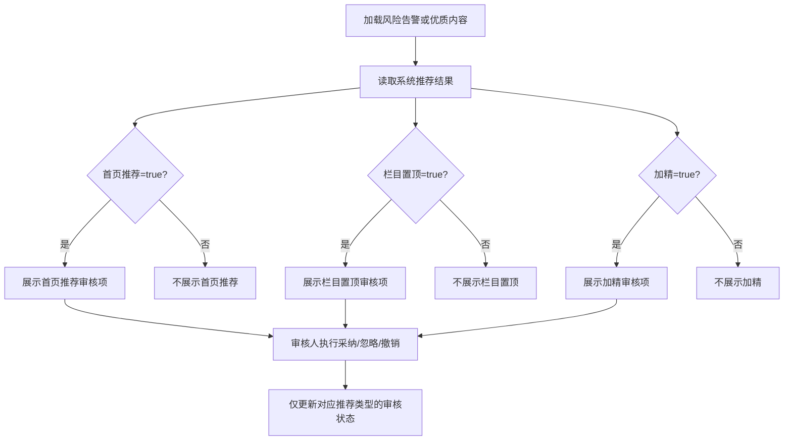

# 独立审核仅展示系统推荐项需求

## 1. 需求概述

### 1.1 背景与目标

舆情通知管理的“独立审核”当前会同时展示“首页推荐、栏目置顶、加精”三种功能，并通过“AI 建议 / AI 不建议”区分推荐结果。这使审核人员需要阅读和跳过系统没有推荐的操作，增加认知负担，也容易误操作。

本需求将“独立审核”限定为系统推荐结果的审核入口：系统推荐什么功能，页面就只展示什么功能；系统未推荐的功能不显示名称、状态或操作。

### 1.2 适用范围

- 舆情通知管理 - 风险告警管理。
- 舆情通知管理 - 优质内容管理。
- 上述模块中出现“独立审核”的列表列、详情抽屉及相关审核操作。

### 1.3 不在本期范围

- 不修改 AI 对首页推荐、栏目置顶、加精的判断算法或阈值。
- 不改变推荐结果的数据字段及已有审核状态。
- 不删除历史审核记录。
- 不新增推荐类型。
- 不改变采纳、忽略、撤销的业务含义和权限。

## 2. 页面交互流程图

## 3. 详细字段定义

### 3.1 独立审核列表字段

| 字段名称 | 显示条件 | 展示内容 |
| :--- | :--- | :--- |
| 首页推荐 | `recommend_home = true` | 推荐类型、审核状态及对应操作。 |
| 栏目置顶 | `recommend_pin = true` | 推荐类型、审核状态及对应操作。 |
| 加精 | `recommend_feature = true` | 推荐类型、审核状态及对应操作。 |

显示规则：

- 推荐字段为 `false`、`0`、`null` 或缺失时，对应审核项整体不渲染。
- 不再展示“AI 不建议”文案。
- 一条内容存在多个 `true` 时，按“首页推荐、栏目置顶、加精”的固定顺序展示被推荐项。
- 一条内容只有“加精”为 `true` 时，“独立审核”列只能出现“加精”，不得出现首页推荐或栏目置顶。
- 三项均未推荐时，“独立审核”列显示 `--`，不显示按钮。

### 3.2 审核项内容

| 字段 | 类型 | 必填 | 默认值 | 校验 / 枚举 |
| :--- | :--- | :--- | :--- | :--- |
| 推荐类型 | 文本 | 是 | 系统结果 | `首页推荐`、`栏目置顶`、`加精`。 |
| 审核状态 | 标签 | 是 | `待审核` | `待审核`、`已采纳`、`已忽略`。 |
| 采纳 | 操作 | 否 | - | 仅对当前可见推荐类型生效。 |
| 忽略 | 操作 | 否 | - | 仅对当前可见推荐类型生效。 |
| 撤销 | 操作 | 否 | - | 将当前可见推荐类型恢复为待审核。 |

## 4. 功能逻辑

### 4.1 列表展示

- 风险告警管理和优质内容管理使用同一套推荐项过滤规则。
- 页面必须以服务端返回的三个推荐布尔字段为准，不根据推荐理由文本猜测推荐类型。
- 推荐项过滤只影响展示，不改变列表入选条件、排序、分页总数或筛选结果。
- “全部推荐类型”筛选仍可返回包含任一推荐项的内容；指定推荐类型时，只返回或展示该类型被系统推荐的内容。

### 4.2 详情抽屉

- 详情抽屉与列表使用相同过滤结果。
- 列表只显示“加精”时，详情抽屉也只能显示“加精”审核模块。
- 系统未推荐的类型不得因历史审核状态存在而重新显示。
- 历史审核数据继续保留，仅不作为当前独立审核入口展示。

### 4.3 审核操作

- 每个可见推荐项独立审核；操作不得联动修改其他推荐类型。
- 操作成功后，仅刷新当前推荐项的审核状态。
- 操作失败时保留原状态，并显示明确失败提示。
- 重复点击时应防止重复提交；请求进行中对应按钮禁用。
- 用户无审核权限时，只展示推荐项与审核状态，不展示操作按钮。

## 5. 异常与边界情况

### 5.1 数据异常

- 三个推荐字段均为假值：显示 `--`，不显示审核操作。
- 推荐字段类型异常：按未推荐处理，并记录前端可观测错误；不得误开放审核操作。
- 推荐为真但审核状态缺失：按 `待审核` 展示。
- 推荐理由同时提及多个功能，但布尔字段只推荐一项：仅展示布尔字段为真的一项。

### 5.2 历史数据

- 某类型曾被审核，但当前系统结果已变为不推荐：该类型从独立审核中隐藏。
- 已隐藏类型的历史采纳、忽略、撤销记录仍保留在审计数据中，不删除、不重置。
- 后续重新分析再次推荐该类型时，审核状态按现有服务端版本与审核状态规则返回；页面不自行恢复或覆盖状态。

### 5.3 权限边界

- 有审核权限：可对系统推荐项执行采纳、忽略、撤销。
- 无审核权限：只能查看推荐类型和状态。
- 系统未推荐项对所有角色均不显示，不能通过前端操作入口提交审核。

### 5.4 操作异常

- 列表接口或详情接口失败：显示模块级错误状态，不回退为三项全部展示。
- 审核请求失败：提示失败原因，当前项保持原状态。
- 同一内容多项推荐时，一项操作失败不影响其他项的展示和状态。

## 6. 用户文案

| 场景 | 文案 |
| :--- | :--- |
| 推荐项待处理 | `待审核` |
| 推荐项已采纳 | `已采纳` |
| 推荐项已忽略 | `已忽略` |
| 无系统推荐项 | `--` |
| 操作成功 | `审核状态已更新` |
| 操作失败 | `操作失败：{原因}` |

页面删除“AI 建议”和“AI 不建议”后缀。推荐项出现在“独立审核”中本身即代表系统推荐，无需重复说明。

## 7. 验收标准

1. 当 `recommend_feature = true`、其余两项为假时，列表和详情只显示“加精”。
2. 当 `recommend_home = true`、`recommend_pin = true`、`recommend_feature = false` 时，只显示“首页推荐”和“栏目置顶”。
3. 三项均为真时显示三项，且顺序固定为“首页推荐、栏目置顶、加精”。
4. 三项均为假时显示 `--`，不显示审核按钮。
5. 页面不再出现“AI 不建议”文案。
6. 系统未推荐项即使存在历史审核状态，也不在列表或详情显示；历史记录不被删除。
7. 对一个可见推荐项执行采纳、忽略或撤销，只更新该项状态，不影响其他推荐项。
8. 风险告警管理与优质内容管理在列表和详情中表现一致。
9. 无审核权限用户看不到操作按钮，但仍能看到系统推荐类型和审核状态。
10. 接口异常或字段异常时不得回退为三项全部展示。

## 8. 优先级

| 优先级 | 范围 |
| :--- | :--- |
| P0 | 列表和详情只渲染系统推荐项，隐藏未推荐项及其操作。 |
| P0 | 风险告警管理与优质内容管理使用一致规则。 |
| P1 | 补充权限态、请求中禁用和字段异常的防误操作处理。 |

## 9. 已确认决策

- “独立审核”只显示系统推荐的功能。
- 系统只推荐加精时，首页推荐和栏目置顶不得显示。
- 系统推荐多项时，只展示被推荐的多项。
- 列表与详情保持一致。
- 没有系统推荐项时显示 `--`，不创建空审核操作。
- 不修改 AI 推荐算法，不删除历史审核数据。
